# Prueba Técnica GENIO

## Correr el proyecto de forma local 

 * Instalar los nodulos de node bajo node 18 o superior con el comando `npm install`

 ### Tecnologias

 * Nextjs 14 con typescript
 * Tailwind
 
 ### Enfoque adaptado

Se crea un blog de noticias con la api `https://fernandafamiliar.soy/wp-json/wp/v2/`, mostrando las ultimas 10 noticias importantes en la republica méxicana.

# Explicacion codigo 

### Componentes

Se crean multiples componentes modulares y reutilizables para estructurar la pagina. 

Componentes encargados de mostrar titulos, parrafos, y spiners en pantalla de carga.

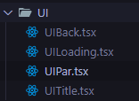

Componentes que estructuran el proyecto en su totalidad

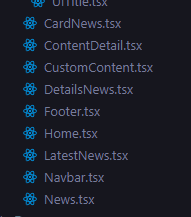

Paginas del proyecto, la pagina llamada `slug` es dinamica, y actua conforme el titulo de la noticia, creando una pagina automatica por cada noticia, de esta forma nos evitamos estar creando multiples paginas y dejamos que next js se encargue de eso con `ISR` 

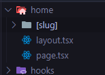

## Llamada a la API

Llamamos la api desde el lado del servidor en la pagina principal, que sera llamada home,
una vez que tengamos los datos cargados se procede a hidratar los componentes `News` y `Latest News` con sus props a la espera.

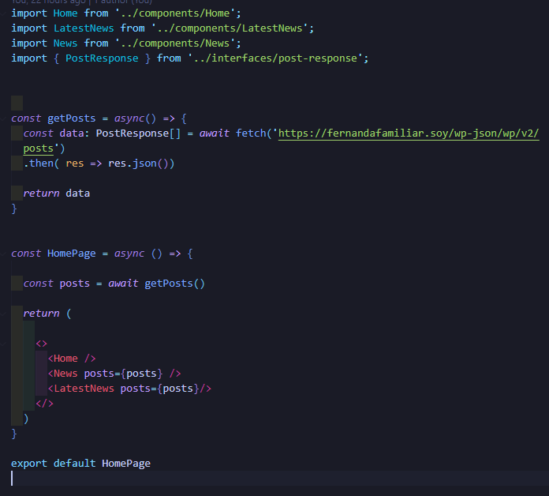

## Incremental Static Regeneration

Utilizamos esta funcion de next js para crear en tiempo de `build` las paginas por `slug`, de esta forma evitamos que en produccion el cliente cree las paginas, retrasando la fluides del sitio.

Paginas Creadas en build

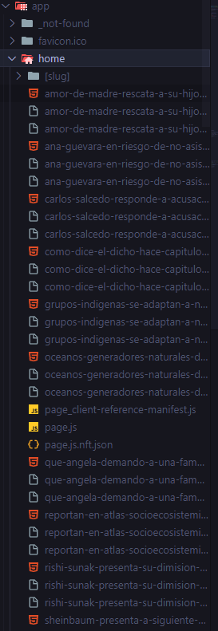

En este caso se uso `slug` de la misma api para generar las paginas en tiempo de `build`, 
que se revalidara cada 5 hrs esperando cambios. como es un sitio que no trae datos de forma constante, considero que ese tiempo es el correcto. De igual forma se hace el llamado en el lado del servidor. Dandole una capa extra de seguridad, ya que no tenemos los datos en cliente. 

Se puede apreciar las ventajas de `(ISR)` en producción, mostrando fluides al darle click a la noticia y ver el articulo completo.

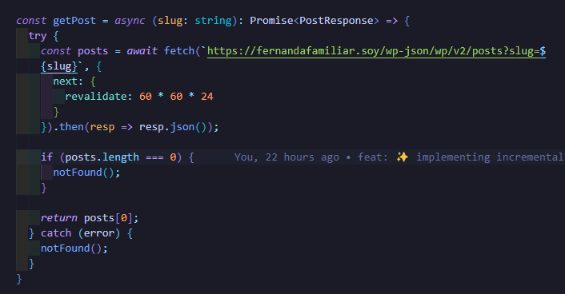

# GTM y GA4

Se agregan funcionalidad para ver metricas del sitio atraves de `Google Tag Manager` y `Google Analitics 4`

Creamos los tags en la pagina de google y las agregamos al proyecto 

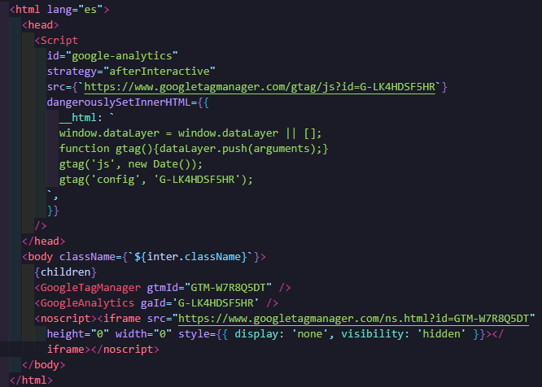

Una vez hecho esto subimos el sitio a produccion y corroboramos que las etiquetas esten jalando de forma correcta. 

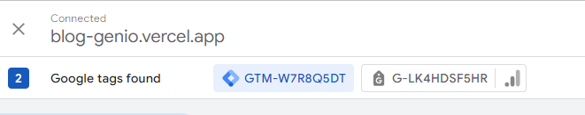

Con esto comprobado podemos empezar a crear las metricas personalizadas para enviarlas a `Google Analitics`

Se empezaran a medir los clicks a los detalles de las noticias con el `id` para filtrar el click 

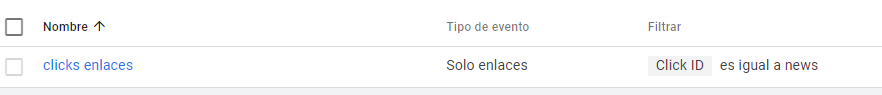

Vemos que cuando damos click  alguna noticia para acceder a su detalle los tags de google son activados, de esta forma ya los podemos recibir en `GA4` 

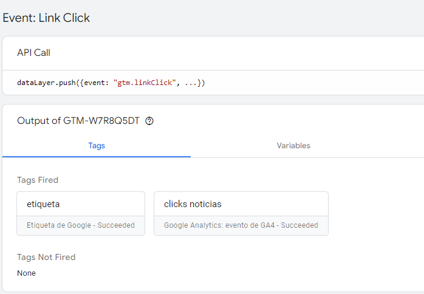

Ceamos el evento clave en Analytics y podemos obersvar en el modo debug que en efecto esta funcioando. Ya que esa banderita verde es el evento clave siendo rastreado. 

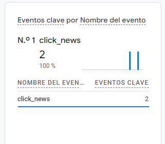

